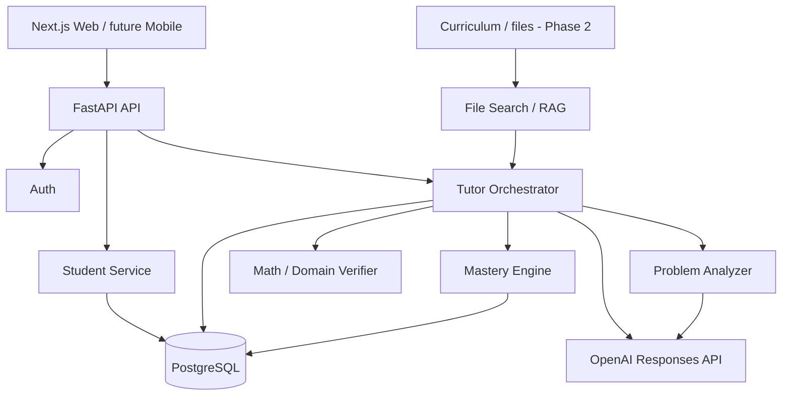

# Architecture

## Design choice
Start as a modular monolith. It is cheaper to build, easier to debug, and retains clear seams for future extraction.

## Backend boundaries
- `api`: HTTP only; authorization and input validation.
- `services/tutor_ai.py`: model orchestration and teaching behavior.
- `services/verifier.py`: deterministic checks; never silently trust generation.
- `services/mastery.py`: student-state update logic.
- `models`: persistence.
- `schemas`: contracts between modules and clients.

## Why OpenAI Responses API
The tutor needs text + image input and machine-readable outputs. Responses API supports multimodal input; Structured Outputs can map results into Pydantic models. This gives a clean seam between unstructured model reasoning and application logic.

## Recommended production evolution
### At ~1k daily active learners
- Redis for rate limiting/cache
- async task queue for document ingestion/evals
- object storage for images with short retention
- Alembic migrations
- Sentry/OpenTelemetry
- API gateway/WAF

### At ~10k+ daily active learners
Only extract services based on measured bottlenecks, likely:
- media/OCR pipeline
- analytics/evaluation pipeline
- realtime voice
- recommendation engine

## Model routing
Suggested tiers:
- cheap/fast model: extraction, classification, routine tutoring turns
- stronger reasoning model: ambiguous math, verifier disagreement, complex proofs
- deterministic code: anything that can be reliably checked without an LLM

Route based on confidence, problem type and verifier disagreement rather than using the strongest model for everything.
