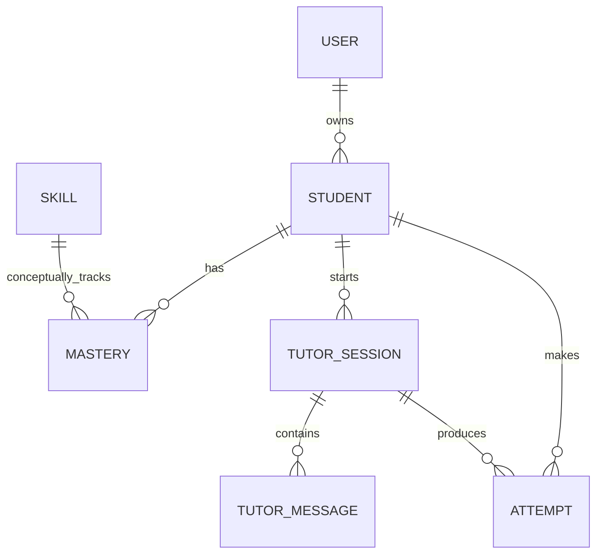

# Data model

## Entities
### users
Parent/account holder in MVP. Do not put sensitive educational notes directly on this table.

### students
Minimal learner profile: display name, grade, language. Add date of birth only if the product genuinely needs it and a compliant consent flow exists.

### skills
Curriculum taxonomy. Use stable codes, not model-generated display labels.

Example:
- `algebra.integer_operations`
- `algebra.linear_equation`
- `algebra.factorization`
- `algebra.rational_expression.domain`

### mastery
One row per student/skill. MVP probability is heuristic and should be described to users as an estimate, not a scientific score.

### tutor_sessions / tutor_messages
Stores learning history. Establish retention controls before public launch.

### attempts
The most valuable event table for future learning science. Store:
- correctness
- skill
- hints used
- misconception tag
- timestamp

Later add response time, problem difficulty and question ID.
